# JavaGameOOP

## RED HOOD - 2D Dark Fantasy RPG

A fully object-oriented Java game that showcases the power of OOP principles in game design. Built with a focus on clean architecture, modular structure, and maintainable code, this project combines solid programming fundamentals with fun and challenging gameplay in a dark-fantasy setting.

### 📖 Story

Red Hood, a brave and skilled wizard, discovers an ancient manuscript that reveals the existence of a legendary magic potion - a brew capable of granting mastery over any spell. However, Valthros, an evil wizard with plans for world domination, is seeking the same ingredients.

The ingredients are hidden in a cursed cemetery, guarded by the spirits of those who tried and failed to create the potion. Red Hood must face waves of enemies, deadly traps, and the darkness itself to stop Valthros and save the world.

### ✨ Features

**Gameplay**
* **5 Progressive Levels** - Each level introduces new mechanics and increases in difficulty
* **Dual Combat System** - Melee and ranged attacks with stamina management
* **Ingredient Collection** - Find magic potions to progress and win
* **NPC Interaction** - Friendly wizards offer tips and stories
* **Fog of War System** - Limited visibility in dark levels
* **Save/Load System** - Save progress and continue later

**Enemies and Challenge**
* **4 Unique Enemy Types** - Each with its own mechanics and distinct AI
* **Epic Boss Fight** - Final confrontation with Valthros, the evil wizard
* **Progressive Design** - Every mechanic learned is essential to finish the game
* **Strategic Positioning** - Enemies are placed to create tactical challenges

**Audio and Atmosphere**
* **Original Soundtrack** - 3 musical tracks for menu and levels
* **Sound Effects** - 9 sound effects for actions and interactions
* **Full Audio Control** - Adjust music and effects volume independently

**OOP Architecture**
* **Modular Structure** - Clean, organized, and easy-to-maintain code
* **OOP Principles** - Encapsulation, inheritance, polymorphism, and abstraction
* **Design Patterns** - Factory Method, Abstract Factory, State Pattern
* **SQL Database** - Data persistence and player progress

### ✨ Features

**Gameplay**
* **5 Progressive Levels** - Each level introduces new mechanics and increases in difficulty
* **Dual Combat System** - Melee and ranged attacks with stamina management
* **Ingredient Collection** - Find magic potions to progress and win
* **NPC Interaction** - Friendly wizards offer tips and stories
* **Fog of War System** - Limited visibility in dark levels
* **Save/Load System** - Save progress and continue later

**Enemies and Challenge**
* **4 Unique Enemy Types** - Each with its own mechanics and distinct AI
* **Epic Boss Fight** - Final confrontation with Valthros, the evil wizard
* **Progressive Design** - Every mechanic learned is essential to finish the game
* **Strategic Positioning** - Enemies are placed to create tactical challenges

**Audio and Atmosphere**
* **Original Soundtrack** - 3 musical tracks for menu and levels
* **Sound Effects** - 9 sound effects for actions and interactions
* **Full Audio Control** - Adjust music and effects volume independently

**OOP Architecture**
* **Modular Structure** - Clean, organized, and easy-to-maintain code
* **OOP Principles** - Encapsulation, inheritance, polymorphism, and abstraction
* **Design Patterns** - Factory Method, Abstract Factory, State Pattern
* **SQL Database** - Data persistence and player progress

---

### 🎮 Controls

| Action | Key |
| :--- | :---: |
| Move Left/Right | `A` / `D` |
| Jump | `W` / `SPACE` |
| Melee Attack | `Left Click` |
| Ranged Attack | `Q` |
| Interact with NPC | `E` |
| Pause | `ESC` |

### 🖼️ Screenshots

**Main Menu**

*Intuitive interface with options for Play, Settings, Scores, and Quit*

### Gameplay Core

**Dynamic Camera**
Smoothly follows the character across the entire map, offering a cinematic experience.

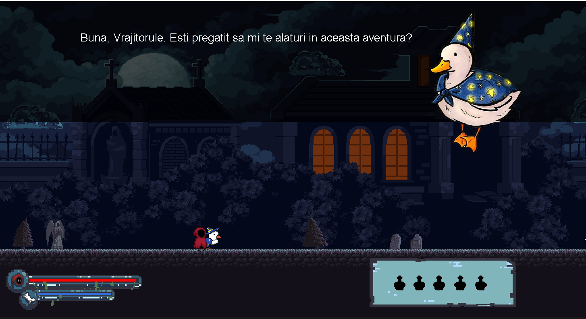

**Advanced Platforming**
Explore on ground, bridges, clouds, and many other surfaces. Each level introduces new platforming challenges.
**Destructible Objects**
Discover potions by breaking strategically placed crates and barrels on the map.

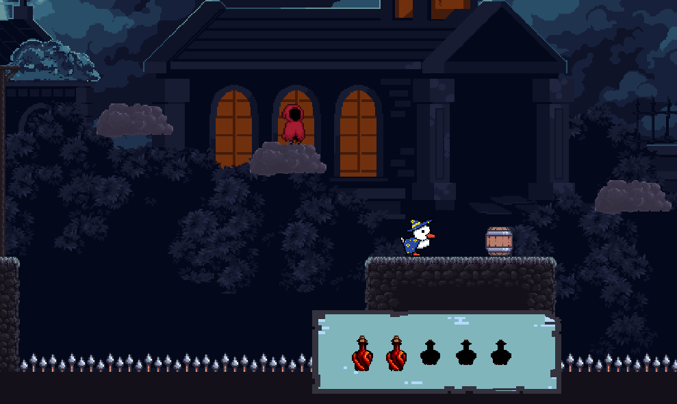

**Fog of War**
Dark levels limit player visibility, creating tension and requiring careful exploration.

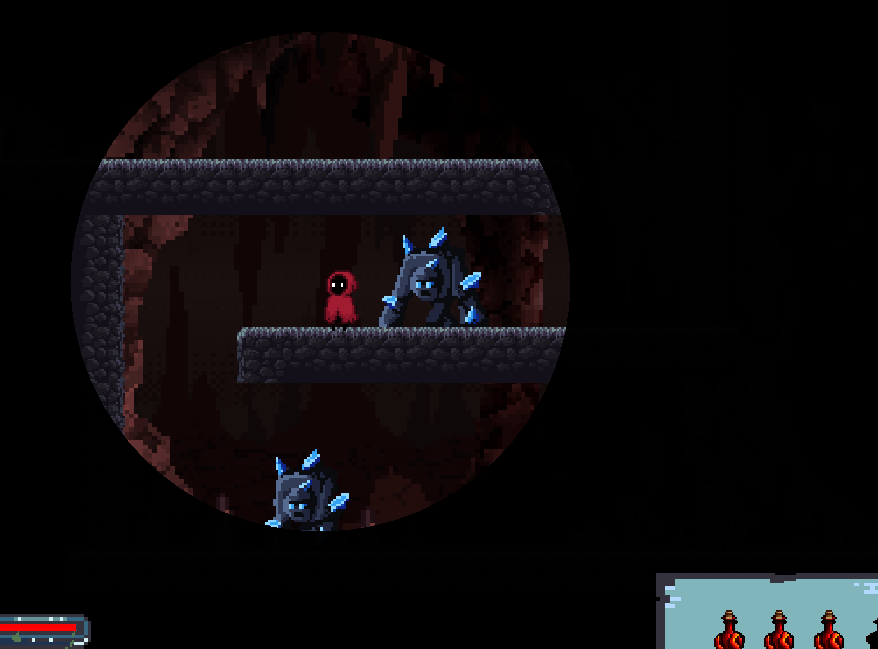

**Trap System**
Avoid lethal spikes, automated cannons, and toxic tar zones that require quick reflexes and planning.

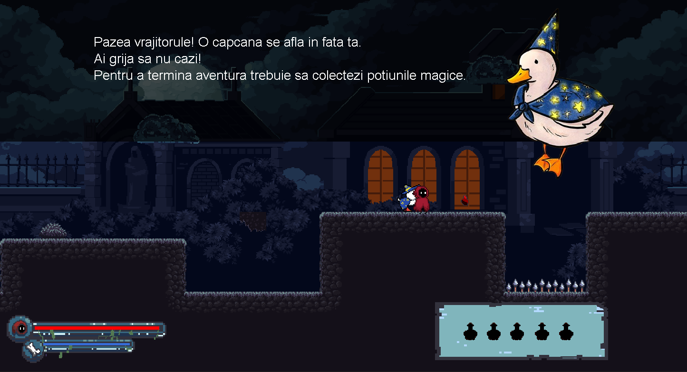
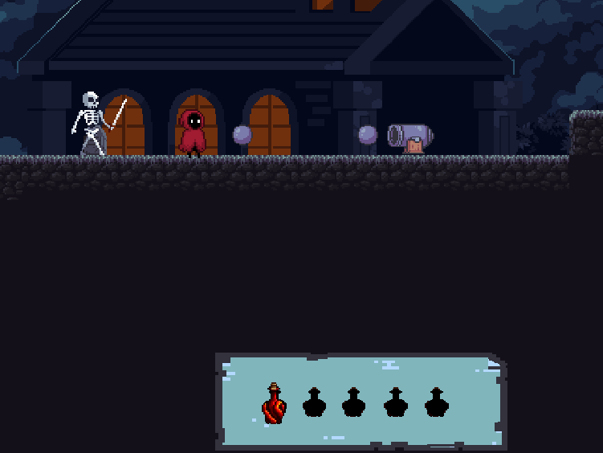

### Enemy Types

**Sword Skeletons**
The first enemies encountered, guarding the cemetery entrance. They offer a gentle introduction to the game's combat system.

**Mace Skeletons**
Stronger and more aggressive variants that can occasionally spawn poison potions. Defeating them requires more advanced tactics.

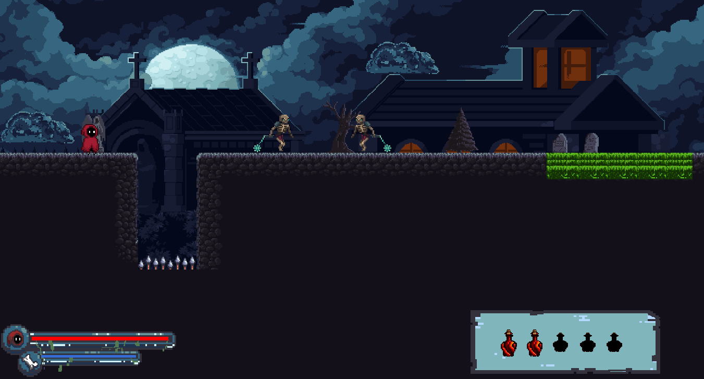

**Golems**
Massive crypt guardians that increase in speed and aggression when wounded. A major danger requiring careful resource management.

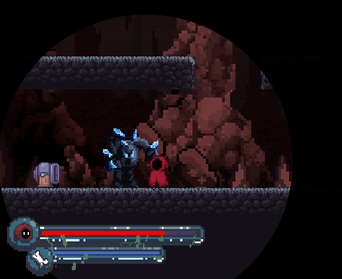

### Boss Fight
**Valthros (Final Boss)**
The evil wizard with devastating attacks, both melee and ranged. Permanent health bar on screen. The final confrontation requires all skills learned throughout the game.

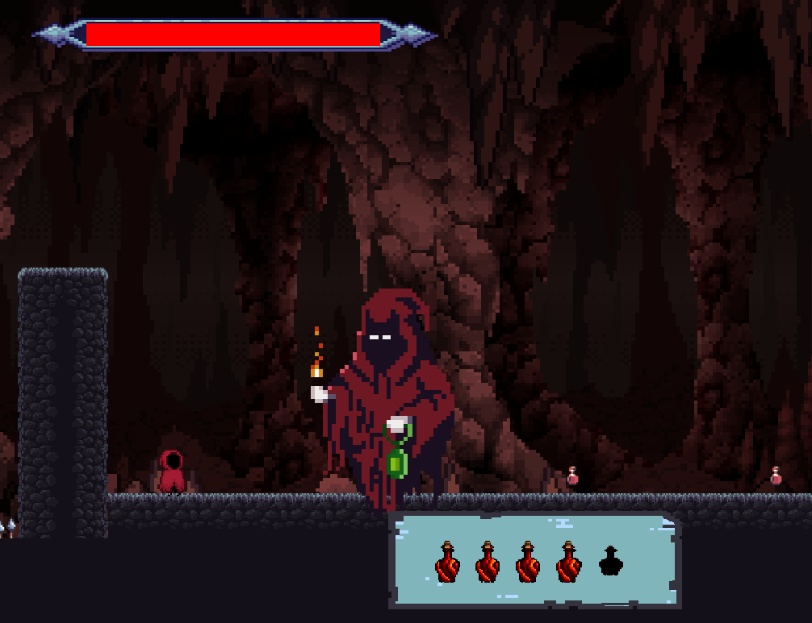
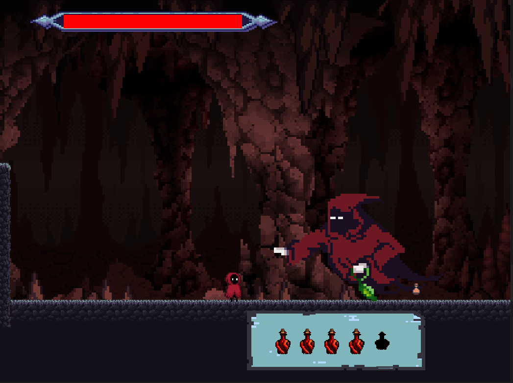

### Interfaces and Systems

**Settings**

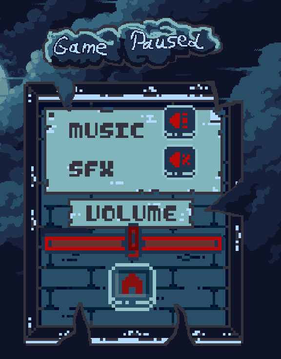

**Level Completed and Death Screen**

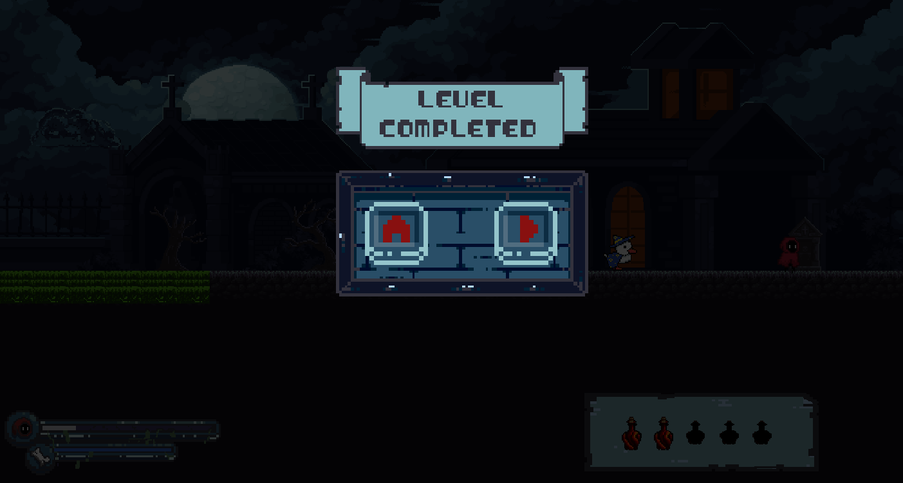
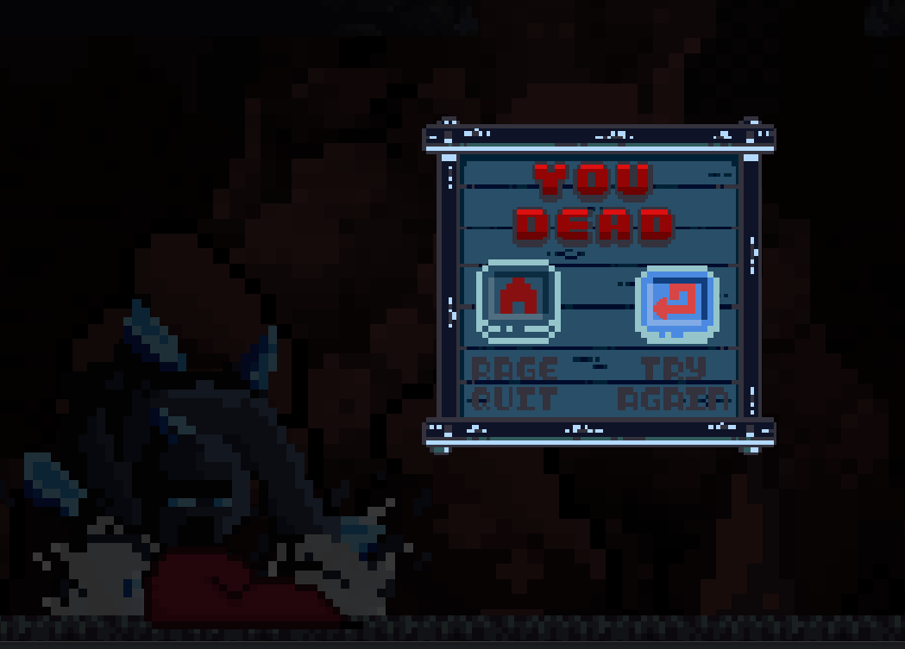

